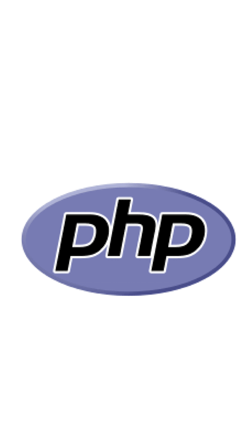

<h1 align="center">Hi , I'm Matías Coco </h1>

 
<picture></picture> About me

<picture> </picture>

 

- :school: I am currently studying for a Web Development degree at the National University of La Matanza, with 16 out of 20 courses completed.
- :briefcase: I am currently working part-time as a PHP developer for the [National University of La Matanza](https://www.unlam.edu.ar/), and I am also working at Epix as a project designer specializing in fire protection engineering.
- :technologist: I love programming because it allows me to solve problems creatively and build solutions that can make a real impact. It’s exciting to turn ideas into functional applications and constantly learn new technologies. Programming challenges me to think logically and keeps me motivated to grow every day.
- :student: I’m currently learning `React` and `Node.js`.
- :nerd_face: Always `learning new things`.
- :thinking: I’m currently open for a new `job opportunity`, this is [MY CV](https://drive.google.com/file/d/1HwNup_F8VZ-rgTvRIT3FErH1DP_XoRqv/view?usp=sharing).
   

## <picture>  </picture> Connect with me

	&emsp;
	&emsp;
	

## 🛠️ My Skills

<!-- Frontend Development ---------------------------------------------------------------------------------------------------------------------------------->

### <picture>  </picture> Frontend Development

  &emsp;
  
  &emsp;
  
  &emsp;
  
  &emsp;
  
  &emsp;
  
  &emsp;
  
  &emsp;
  

<!-- Backend Development ---------------------------------------------------------------------------------------------------------------------------------->

### <picture>  </picture> Backend Development

  &emsp;
  
  &emsp;
  
  &emsp;
  
  &emsp;
  
  &emsp;
  

<!-- Software & Tools ---------------------------------------------------------------------------------------------------------------------------------->

### <picture>  </picture> Software & Tools

  &emsp;
    
  &emsp;
    
  &emsp;
    

<!-- Database -->

  &emsp;
  
  &emsp;
  
  &emsp;
  

<!-- Testing -->

  &emsp;
  
  &emsp;
  
  &emsp;
  

<!-- Graphic Design -->

  &emsp;
  
  &emsp;
  
  &emsp;
  

<!-- IDES ------------------------------------------------------------------------------------------------------------------------------------>

### <picture>  </picture> IDEs

  &emsp;
    
   &emsp;
    
  &emsp;
    
  &emsp;
    

 
